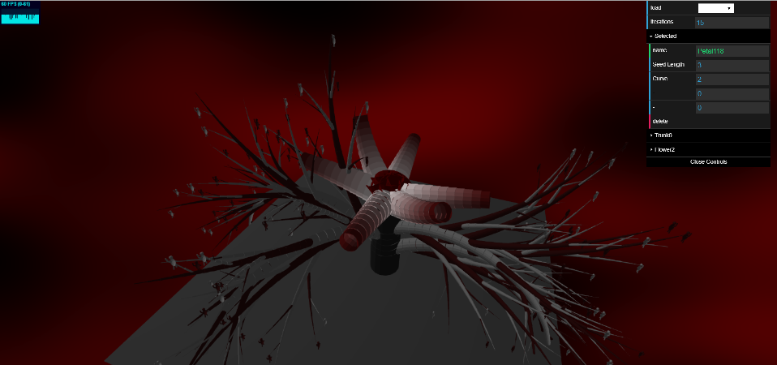
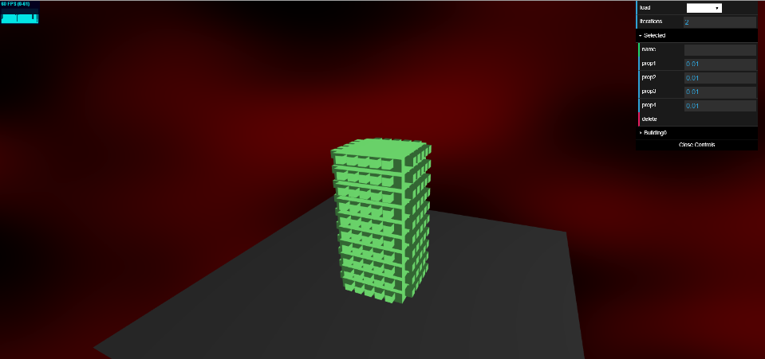
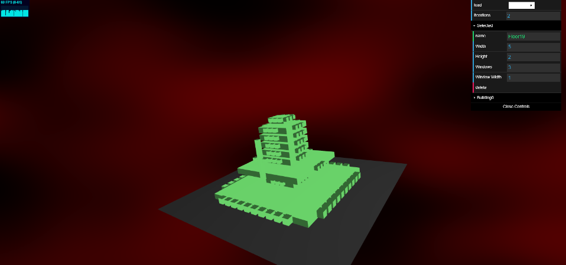
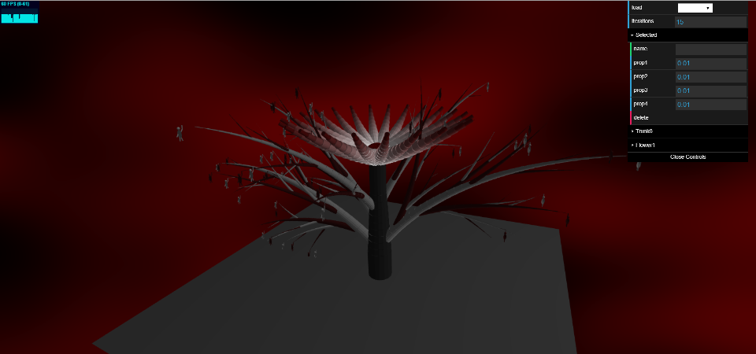

# Modifiable LSystems

Clemen Deng (PennKey: clemen)

This project is based on [this paper](https://www.graphics.rwth-aachen.de/media/papers/krecklau_generalized_grammar_071.pdf) on generalized grammar systems.

[WebGL link](https://clemendeng.github.io/hw04-l-systems/)

#### User Friendly Lsystem

## Dynamic GUI

The gui interface in this program reflects the state of the lsystem. Expansion rules are represented as folders containing the rules that they expand into. If any elements are changed or deleted, the interface is updated to reflect these changes.

## Selection tools

The rules of the lsystem can be selected in the GUI interface. When selected, their attributes are displayed. The user can then modify these attributes. If the rule is an expansion rule, the modifications are propagated downward to its children. The changes are reflected in the output.

The selected element can also be deleted.

Additionally, the user can change the number of iterations that the lsystem expands.

## Loading Templates

There are two different lsystem templates the user can load. One is a simple building, one is a plant. The plant is more of an expandable lsystem, whereas the building only needs two iterations to expand fully.

## Examples

Here are the templates and an example modification of each template:

