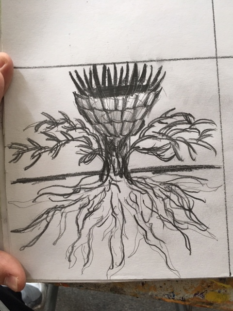

# BEHOLD

Clemen Deng (PennKey: clemen)

This project is created using L-systems. Viewing this project requires a WebGL capable browser. All content is original.

[WebGL link](https://clemendeng.github.io/hw04-l-systems/)

## Features

This project was modeled on the following image:

#### L-Systems
This project is created using an L-system, which incorporates saving, loading, and randomness. The L-system is able to move in all three dimensions.

#### Instanced rendering
This project uses instanced rendering to render multiple instances of a single object. The project is created using only two primitives, not including the square base.

#### Procedural background
The background is created using fractal brownian motion of perlin noise.

#### GUI Elements
The user can modify three attributes of the L-system: iterations, size, and rotation. Iterations modifies how much the L-system expands. Size is a limit on the size of the tree. Rotation modifies how much the branches rotate.