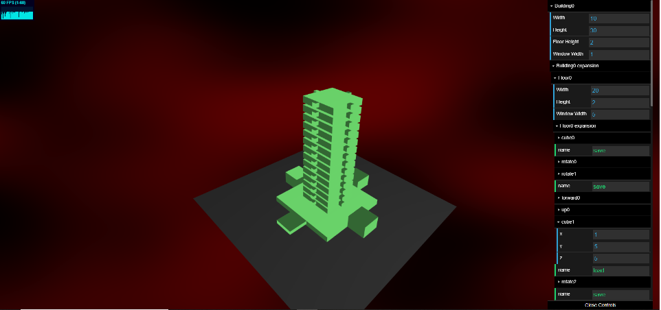

# LSystem Exploration

Clemen Deng (PennKey: clemen)

This project is based on [this paper](https://www.graphics.rwth-aachen.de/media/papers/krecklau_generalized_grammar_071.pdf) on generalized grammar systems.

## Overview

Alright look, I don't have much to show for this midpoint, but it's not for lack of trying. There is nothing to display other than my current working lsystem from homework 4, so instead I will walk you through my struggles.

Setup: I combined my hw4 code and my city generation code into a generalized lsystem, that includes a turtle that can move in three dimensions and supports loading objs as primitives to instance render.

Parameterized: I set up my lsystem to include parameters to rules, such that whenever a 'p' character is seen the next characters will be digits that represent a parameter for the following character. Now instead of 'ffff' to move forward 4, the string is 'p4f'.

First attempt: Implement Rule classes for my lsystem. These rule classes are defined by implicit attributes, and have defined operators. For example, a box class would be defined by sizex, sizey, and sizez, and all rules relating to boxes would be part of the box class. Boxes would also have operators. These could modify its attributes, or they could create new boxes. To implement these rule classes, I looked into inheritance in typescript. I wanted a class to be able to access attributes of its parent class, so that a rule that is part of the Box class could access the Lsystem class' attributes (i.e. to modify the turtle). After doing some research I came to the conclusion that this was not very feasible. 

Second attempt: I came to the conclusion that implementing the elements in the paper exactly would be extremely tricky and not very rewarding, because I wasn't exactly sure how I would apply them. I decided to work towards a more concrete goal: have a user modifiable lsystem.

## User Friendly Lsystem

This interface would have the current lsystem displayed, and also have a menu on the right displaying all of the rules. The menu would display any children rules as well. So for example, if our plant is 'P', which expands into 'SLSLS' (stems and leaves), the stems and leaves would be children of 'P'. This would be displayed in the gui in some hierarchical manner. All of these rules (plants, stems, leaves) would have attributes similar to the box attributes talked about above. The user would then be allowed to go in and modify attributes of the elements: length of the plant, length of the stems, shape of the leaves, etc. They could also add primitives in.

The user could also add in additional elements. They would modify the attributes of the turtle, create primitives, and essentially model in real time. The element they model would be displayed separately from the main lsystem. For example, they could model 'B', a berry, by combining a few spheres. Then they could incorporate the modeled primitives into the lsystem.

## User Friendly Lsystem Design

I then spend many hours trying to come up with a working framework that could display these rules, allow the user to select them, and modify them. I know I am going to have a Rule class, which includes an expansion function that expands the rule into a Rule[], a function is to be called when the lsystem is being processed, and a Rule[] to track its child rules. After finally reaching this conclusion, I tried to implement a simple building and realized having a class with functions as parameters is not that straightforward. I am currently trying to find a workaround for this.

The overall grammar system will have the axiom, the current Rule[], and an expansion history of type Rule[][] that tracks previous expansions. The index of this will be the iteration number, so for example history[0] will just contain the axiom. When the user selects an element in the GUI, the program will retrieve the depth of the element (since they will be displayed hierarchically), and retrieve the Rule associated with that element. Then if the user modifies its parameters the program will modify them and update the lsystem.

## Code

If you guys do end up seeing this soon, LSystem.ts contains the generalized lsystem that supports parameters, and it also has an attempt a creating a Box class. Rule.ts contains the user friendly lsystem design part. Any suggestions are greatly appreciated.